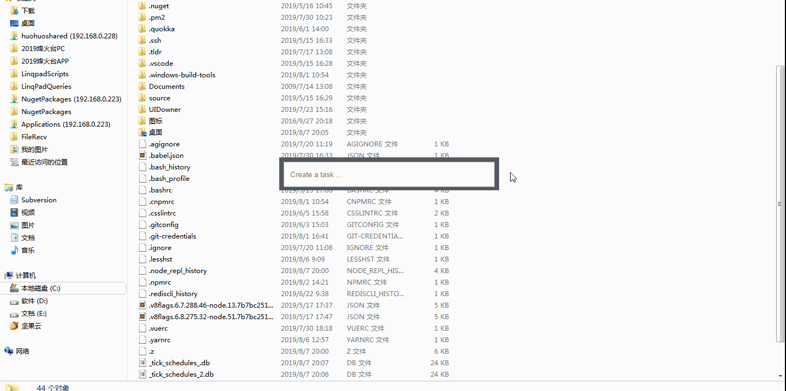
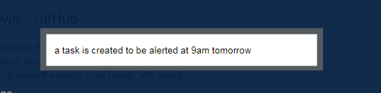
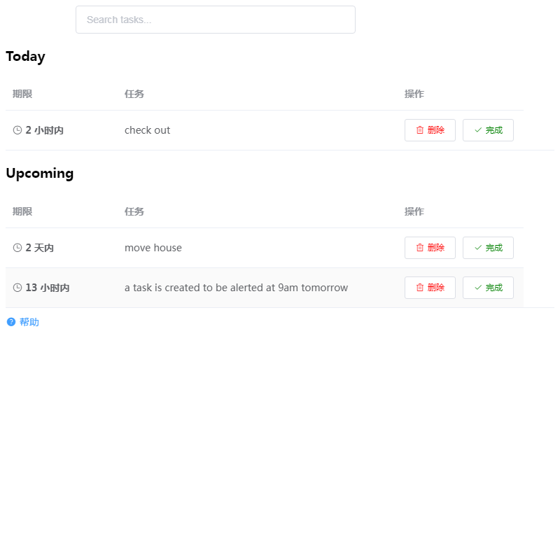
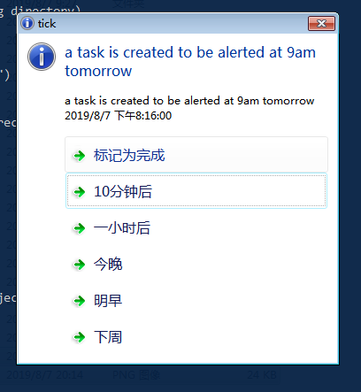

Tick - an express task/alert manager
====================================

# Background

> 好记性不如烂笔头 -- 中国谚语

> The palest ink is better than the best memory -- Ancient Chinese Proverb.

# Demo screenshot

# Build

build with yarn (**not npm**). Make sure you have node-gyp and electron-builder installed.

# Usage

Ctrl+S to open the command window, and subsequently:

1. run a command, e.g. `quit`, `exit`, `reboot`, `restart`, `list`;
2. create a new task, e.g.
   - 100s `buy stuff in 100 seconds`
   - 10m `buy stuff in 10 minutes`
   - 2h `buy stuff in 2 hours`
   - tonight `buy stuff`
   - tmr `buy stuff`
   - tomorrow `buy stuff (same as above)`
   - next week `buy stuff`
   - tmr 9am `buy stuff`
   - tmr 5pm `buy stuff`
   - tmr 1700 `buy stuff (same as above)`
   - next friday `buy stuff`
   - plus a lot more time formats supported by [datejs](https://github.com/datejs/Datejs#parsing)

# TODO

* command autocompletion/suggestion (or show parsed time in real time)
* more unit tests on command parsing.

